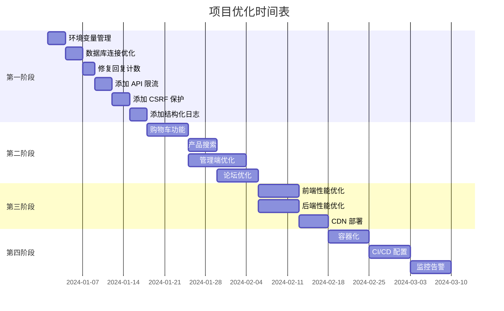

# YHthestudio 项目优化计划

## 项目概述

**项目名称**: YHthestudio - Vue 3 电子商务与论坛平台

**当前架构**:
```
┌─────────────────────────────────────────────────────────────┐
│                        用户浏览器                            │
└─────────────────────────────────────────────────────────────┘
                              │
                              ▼
┌─────────────────────────────────────────────────────────────┐
│              Vue 3 前端 (Vite, Port 5173)                    │
│  - Vue Router (路由)                                         │
│  - Pinia (状态管理)                                          │
│  - Vue I18n (国际化)                                         │
│  - Axios (HTTP 客户端)                                       │
└─────────────────────────────────────────────────────────────┘
                              │
                              ▼
┌─────────────────────────────────────────────────────────────┐
│          Node.js/Express API 网关 (Port 3000)                │
│  - Session 管理                                              │
│  - 用户认证                                                  │
│  - API 路由                                                  │
│  - 静态文件服务                                              │
└─────────────────────────────────────────────────────────────┘
                              │
                              ▼
┌─────────────────────────────────────────────────────────────┐
│          Python/FastAPI 数据库服务 (Port 5100)               │
│  - SQLite 数据库操作                                         │
│  - RPC 接口                                                  │
│  - 数据验证                                                  │
└─────────────────────────────────────────────────────────────┘
                              │
                              ▼
┌─────────────────────────────────────────────────────────────┐
│                    SQLite 数据库                             │
│  - users (用户表)                                            │
│  - products (产品表)                                         │
│  - orders (订单表)                                           │
│  - forum_posts (论坛帖子表)                                  │
│  - forum_replies (论坛回复表)                                │
│  - payment_settings (支付设置表)                             │
└─────────────────────────────────────────────────────────────┘
```

---

## 已修复的问题

### 第一阶段优化（2026-03-10 完成）✅

| # | 问题 | 文件 | 修复内容 | 状态 |
|---|------|------|----------|------|
| 1 | 论坛回复计数重复 | `api-server.js:305` | 移除重复的 `incrementReplies` 调用 | ✅ 已修复 |
| 2 | Session 密钥硬编码 | `api-server.js:23` | 使用环境变量 `SESSION_SECRET` | ✅ 已修复 |
| 3 | 数据库连接无池化 | `py_backend/utils.py` | 实现 `DatabaseConnection` 单例模式 | ✅ 已修复 |
| 4 | 缺少 API 限流 | `api-server.js` | 添加 `express-rate-limit` 中间件 | ✅ 已修复 |
| 5 | 缺少 CSRF 保护 | `api-server.js` | 添加 `csurf` 中间件 | ✅ 已修复 |
| 6 | 缺少结构化日志 | `api-server.js`, `py_backend/main.py` | 添加 Winston (Node.js) 和 logging (Python) | ✅ 已修复 |
| 7 | 环境变量管理 | 新建 `.env.example` | 创建环境变量配置文件 | ✅ 已修复 |

### 第二阶段优化（部分完成）✅

#### 用户端功能

| # | 功能 | 文件 | 状态 |
|---|------|------|------|
| 1 | 购物车功能 | `src/stores/cart.js`, `src/views/user/CartView.vue`, `src/components/user/ProductCard.vue` | ✅ 已完成 |
| 2 | 产品搜索和筛选 | `src/views/user/ProductsView.vue` | ✅ 已完成 |

#### 管理端功能

| # | 功能 | 文件 | 状态 |
|---|------|------|------|
| 1 | 批量操作（批量删除用户） | `src/views/admin/UsersView.vue` | ✅ 已完成 |

### 之前修复的问题

| 问题 | 文件 | 修复内容 |
|------|------|----------|
| Bug: 错误的生命周期函数调用 | `src/views/user/PaymentView.vue:192` | 将 `await onMounted()` 改为正确的 API 调用刷新订单数据 |
| Bug: 数据库连接关闭问题 | `py_backend/main.py` | 移除 rpc 函数中的 conn.close() 调用 |

---

## 待修复问题清单

### 高优先级 (WARNING)

| # | 问题 | 文件位置 | 影响 | 建议修复 |
|---|------|----------|------|----------|
| 1 | 论坛回复计数重复 | `py_backend/modules/forum_replies.py:56` | 每次回复增加 2 次计数 | 移除 API 层的 incrementReplies 调用 |
| 2 | Session 密钥硬编码 | `api-server.js:23` | 安全风险 | 使用环境变量存储 |
| 3 | 数据库连接无池化 | `py_backend/main.py:41-51` | 性能问题 | 实现连接池或单例模式 |

### 中优先级 (SUGGESTION)

| # | 问题 | 文件位置 | 影响 | 建议修复 |
|---|------|----------|------|----------|
| 4 | 表单验证使用 alert | `src/views/user/PaymentView.vue:179` | 用户体验差 | 使用 Toast 组件 |
| 5 | 缺少 API 限流 | `api-server.js` | DDoS 风险 | 添加 express-rate-limit |
| 6 | 缺少 CSRF 保护 | `api-server.js` | 安全风险 | 添加 csurf 中间件 |
| 7 | 缺少结构化日志 | 全局 | 调试困难 | 添加 Winston 日志库 |

---

## 架构优化建议

### 第一阶段：基础优化（1-2 周）

#### 1. 环境变量管理
**目标**: 将硬编码配置移至环境变量

**文件**: 
- 新建 `.env.example`
- 修改 `api-server.js`
- 新建 `.gitignore` 规则

**配置项**:
```env
# 服务器配置
PORT=3000
HOST=0.0.0.0

# Session 配置
SESSION_SECRET=your-secret-key-here

# 数据库配置
YH_DB_PATH=data/yhthestudio.db
PY_DB_URL=http://127.0.0.1:5100

# 支付配置
DEFAULT_WALLET_ADDRESS=TXYZabcdefghijklmnopqrstuvwxyz123456
DEFAULT_NETWORK=TRC20
AUTO_DELETE_MINUTES=30
```

#### 2. 数据库连接池优化
**目标**: 优化 Python 后端数据库连接管理

**文件**: `py_backend/utils.py`, `py_backend/main.py`

**方案**:
```python
# 单例连接模式
class DatabaseConnection:
    _instance = None
    _conn = None
    
    @classmethod
    def get_connection(cls):
        if cls._conn is None:
            cls._conn = connect()
        return cls._conn
```

#### 3. 修复论坛回复计数
**目标**: 修复回复计数重复增加的问题

**文件**: `api-server.js:305`

**修复**: 移除 `await dbOperations.forumPosts.incrementReplies(postId)`，因为 `ForumReplyManager.create()` 已经处理了计数。

#### 4. 添加 API 限流
**目标**: 防止 API 滥用

**文件**: `api-server.js`

**依赖**: `npm install express-rate-limit`

**配置**:
```javascript
const rateLimit = require('express-rate-limit');

const limiter = rateLimit({
  windowMs: 15 * 60 * 1000, // 15 分钟
  max: 100, // 每个 IP 最多 100 个请求
  message: { error: 'Too many requests, please try again later' }
});

app.use('/api', limiter);
```

#### 5. 添加 CSRF 保护
**目标**: 防止跨站请求伪造攻击

**文件**: `api-server.js`

**依赖**: `npm install csurf`

**配置**:
```javascript
const csrf = require('csurf');
const csrfProtection = csrf({ cookie: true });

// 对需要 CSRF 保护的路由应用中间件
app.post('/api/orders', csrfProtection, ...);
```

#### 6. 添加结构化日志
**目标**: 改进日志记录便于调试

**文件**: `api-server.js`, `py_backend/main.py`

**依赖**: `npm install winston`

**配置**:
```javascript
const winston = require('winston');

const logger = winston.createLogger({
  level: 'info',
  format: winston.format.json(),
  transports: [
    new winston.transports.File({ filename: 'logs/error.log', level: 'error' }),
    new winston.transports.File({ filename: 'logs/combined.log' })
  ]
});
```

---

### 第二阶段：功能增强（2-4 周）

#### 用户端优化

| 功能 | 描述 | 优先级 |
|------|------|--------|
| 购物车功能 | 添加购物车页面，支持多商品批量购买 | 高 |
| 产品搜索 | 添加产品搜索和筛选功能 | 高 |
| 个人资料 | 用户个人资料编辑页面 | 中 |
| 密码找回 | 邮箱验证密码重置 | 中 |
| 订单通知 | 订单状态变更邮件通知 | 低 |

#### 管理端优化

| 功能 | 描述 | 优先级 |
|------|------|--------|
| 批量操作 | 批量删除/更新用户、产品、订单 | 高 |
| 数据导出 | 导出 CSV/Excel 格式数据 | 高 |
| 图表可视化 | 使用 Chart.js 展示销售数据 | 中 |
| 操作日志 | 记录管理员操作历史 | 中 |
| 权限细分 | 超级管理员/普通管理员 | 低 |

#### 论坛优化

| 功能 | 描述 | 优先级 |
|------|------|--------|
| 点赞功能 | 帖子和回复点赞 | 中 |
| 富文本编辑器 | 替换 textarea 为富文本编辑器 | 中 |
| 图片上传 | 支持帖子图片上传 | 中 |
| 帖子分类 | 添加帖子分类/标签系统 | 低 |

---

### 第三阶段：性能优化（4-6 周）

#### 1. 前端性能
- **图片懒加载**: 使用 `loading="lazy"` 属性
- **虚拟滚动**: 长列表使用虚拟滚动
- **代码分割**: 路由级别代码分割
- **资源预加载**: 关键资源预加载

#### 2. 后端性能
- **API 缓存**: 使用 Redis 缓存常用 API 响应
- **数据库索引**: 优化查询索引
- **异步任务**: 使用 Celery 处理耗时任务

#### 3. 静态资源
- **CDN 部署**: 静态资源部署到 CDN
- **资源压缩**: 启用 Gzip/Brotli 压缩
- **缓存策略**: 配置合理的缓存头

---

### 第四阶段：部署优化（6-8 周）

#### 1. 容器化
- **Dockerfile**: 为前端、Node.js 后端、Python 后端创建 Dockerfile
- **Docker Compose**: 编排多容器应用
- **健康检查**: 添加容器健康检查

#### 2. CI/CD
- **自动化测试**: 添加单元测试和集成测试
- **自动化部署**: 配置 GitHub Actions 或 GitLab CI
- **回滚机制**: 配置快速回滚流程

#### 3. 监控告警
- **应用监控**: 使用 Prometheus + Grafana
- **日志聚合**: 使用 ELK Stack
- **告警通知**: 配置异常告警通知

---

## 实施时间表



---

## 风险评估

| 风险 | 可能性 | 影响 | 缓解措施 |
|------|--------|------|----------|
| 数据库迁移数据丢失 | 低 | 高 | 完整备份，测试迁移脚本 |
| API 限流影响正常用户 | 中 | 中 | 合理设置限流阈值 |
| CSRF 保护兼容性问题 | 低 | 中 | 充分测试，提供回滚方案 |
| 性能优化引入新 bug | 中 | 中 | 添加自动化测试 |

---

## 验收标准

### 第一阶段
- [ ] 所有配置项移至环境变量
- [ ] 数据库连接使用单例模式
- [ ] 论坛回复计数正确
- [ ] API 限流生效
- [ ] CSRF 保护启用
- [ ] 日志输出到文件

### 第二阶段
- [ ] 购物车功能可用
- [ ] 产品搜索筛选正常
- [ ] 管理端批量操作可用
- [ ] 数据导出功能正常
- [ ] 富文本编辑器集成

### 第三阶段
- [ ] 页面加载时间 < 2 秒
- [ ] API 响应时间 < 200ms
- [ ] 静态资源 CDN 命中率 > 90%

### 第四阶段
- [ ] Docker 容器正常启动
- [ ] CI/CD 流程自动化
- [ ] 监控面板正常显示
- [ ] 告警通知及时送达

---

## 附录

### 相关文件清单

**前端**:
- `src/views/user/PaymentView.vue`
- `src/views/user/OrdersView.vue`
- `src/views/user/BuyView.vue`
- `src/components/user/ProductCard.vue`

**后端 (Node.js)**:
- `api-server.js`
- `database.js`
- `translate.js`

**后端 (Python)**:
- `py_backend/main.py`
- `py_backend/utils.py`
- `py_backend/modules/orders.py`
- `py_backend/modules/forum_replies.py`
- `py_backend/modules/payment_settings.py`

### 依赖更新

**Node.js 依赖**:
```json
{
  "dependencies": {
    "dotenv": "^16.0.0",
    "express-rate-limit": "^7.0.0",
    "csurf": "^1.11.0",
    "winston": "^3.8.0"
  }
}
```

**Python 依赖**:
```txt
# 无新增依赖，使用内置功能实现连接池
```

---

*文档生成时间：2026-03-10*
*最后更新：2026-03-10*
